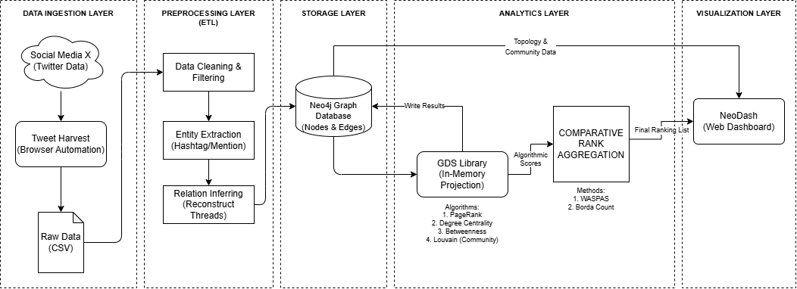
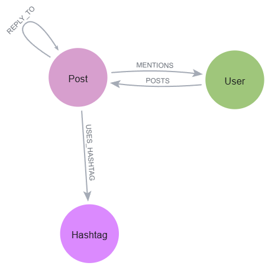
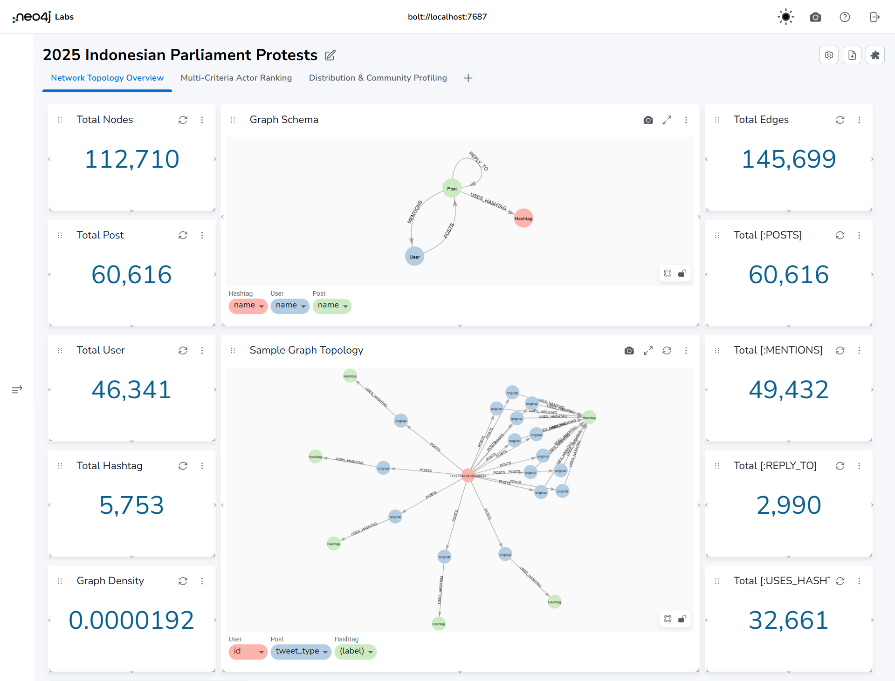
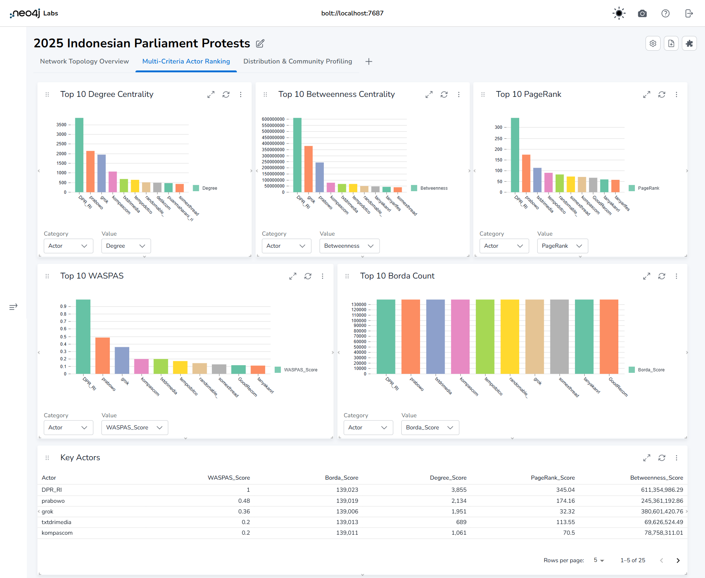
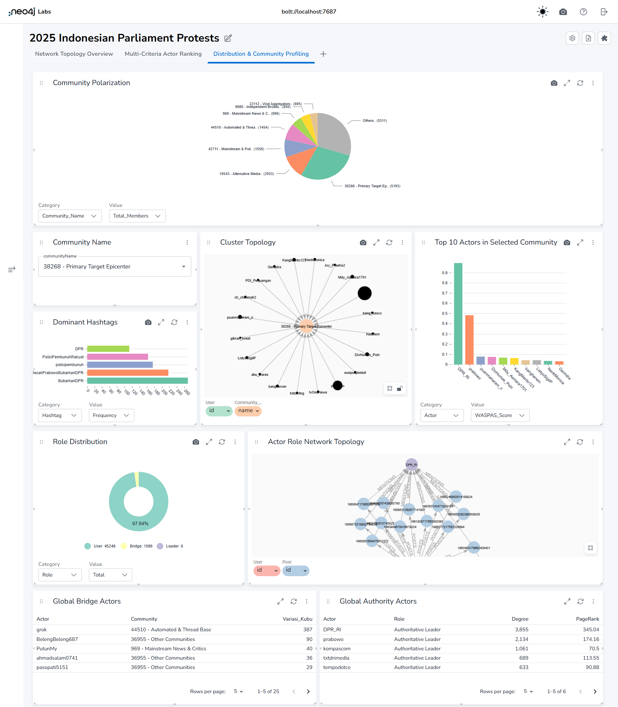

# A Graph-Based Big Data Pipeline Architecture for Social Network Topology Mapping
## A Case Study of the 2025 Indonesian Parliament Protests

---

# Abstract

This repository presents a graph-based big data pipeline architecture for social network topology mapping using Twitter/X data related to the 2025 Indonesian Parliament protest issue.

The proposed pipeline integrates:
- Twitter/X data crawling
- data preprocessing
- graph database modeling using Neo4j
- Graph Data Science (GDS)
- rank aggregation analysis
- NeoDash visualization

The objective of this research is to identify interaction patterns, influential actors, community structures, and social network topology characteristics within online discussions surrounding the 2025 Indonesian Parliament protest issue.

This repository is provided as a reproducible research artifact to support the associated scientific publication.

---

# Research Objectives

The objectives of this research are:

- To design a scalable graph-based big data pipeline architecture
- To construct a social network graph using Twitter/X interaction data
- To analyze graph topology using Neo4j Graph Data Science (GDS)
- To identify influential actors using graph centrality metrics
- To apply WASPAS and Borda Count rank aggregation methods
- To visualize graph structures and analytical results using NeoDash

---

# Research Contributions

This repository provides:

- A complete Twitter/X crawling workflow
- Data preprocessing and graph-ready transformation
- Neo4j graph database implementation
- Graph Data Science (GDS) analysis
- Rank aggregation analysis using WASPAS and Borda Count
- NeoDash-based graph visualization
- Reproducible research pipeline

---

# Repository Structure

```text
graph-big-data-pipeline-social-network-mapping/
│
├── README.md
├── LICENSE
├── .gitignore
│
├── code/
│   ├── CrawlingData.ipynb
│   ├── PreprocessingData.ipynb
│   └── RankAggregation.ipynb
│
├── data/
│   ├── raw_data.csv
│   └── preprocessed_data.csv
│
├── docs/
│   ├── figures/
│   │   ├── pipeline-architecture.png
│   │   ├── graph-schema.png
│   │   ├── neodash-page1.png
│   │   ├── neodash-page2.png
│   │   └── neodash-page3.png
│   │
│   └── neo4j/
│       ├── neo4j-installation-guide.md
│       └── cypher-queries.md

```

---

# Repository Components

## docs/figures/

Contains extended research figures and dashboard visualizations that could not be included in the paper due to space limitations.

Contents include:
- pipeline architecture
- graph schema
- NeoDash dashboard visualization

---

## docs/neo4j/

Contains Neo4j-related documentation.

Files:
- `neo4j-installation-guide.md`
- `cypher-queries.md`

This folder provides:
- Neo4j Desktop installation guide
- database setup instructions
- Cypher query collection
- Graph Data Science (GDS) queries

---

## code/

Contains all research notebooks used in the pipeline.

| Notebook | Description |
|---|---|
| `CrawlingData.ipynb` | Twitter/X crawling pipeline |
| `PreprocessingData.ipynb` | Data preprocessing and transformation |
| `RankAggregation.ipynb` | WASPAS and Borda aggregation analysis |

---

## data/

Contains datasets used throughout the research pipeline.

| File | Description |
|---|---|
| `raw_data.csv` | Raw Twitter/X crawling results |
| `preprocessed_data.csv` | Cleaned and graph-ready dataset used for Neo4j import and analysis |

---

# Proposed Big Data Pipeline

The following figure illustrates the proposed graph-based big data pipeline architecture used in this research.



---

# Research Workflow

The research workflow consists of the following stages:

```text
Twitter/X Crawling
        ↓
Data Preprocessing
        ↓
Neo4j Graph Import
        ↓
Graph Data Science (Cypher)
        ↓
Rank Aggregation (Python Notebook)
        ↓
NeoDash Visualization
        ↓
Result Analysis
```

---

# Graph Schema

The following figure illustrates the graph schema used in this research.



The graph structure consists of:
- User nodes
- Post nodes
- Hashtag nodes
- POSTS relationships
- REPLY_TO relationships
- MENTIONS relationships
- USES_HASHTAG relationships

---

# Neo4j Setup and Configuration

Detailed Neo4j installation and database setup instructions are available in:

```text
docs/neo4j/neo4j-installation-guide.md
```

The guide includes:
- Neo4j Desktop installation
- database configuration
- Bolt connection setup
- CSV import preparation

---

# Cypher Query Collection

Complete Cypher queries used in this research are available in:

```text
docs/neo4j/cypher-queries.md
```

The query collection includes:
- graph import queries
- graph validation queries
- graph enrichment queries
- Graph Data Science (GDS) queries
- result analysis queries

---

# Dataset Description

## Raw Dataset

Location:

```text
data/raw_data.csv
```

Contains:
- original Twitter/X crawling results
- unprocessed datasets
- raw interaction data

---

## Processed Dataset

Location:

```text
data/preprocessed_data.csv
```

Contains:
- cleaned datasets
- normalized data
- graph-ready CSV files
- Neo4j import datasets

The processed dataset uses:
- `;` as field separator
- graph-ready formatting
- normalized attributes

---

# Crawling Process

The crawling process is implemented in:

```text
code/CrawlingData.ipynb
```

Main functions:
- keyword-based Twitter/X crawling
- interaction collection
- metadata extraction
- CSV export

---

# Data Preprocessing

The preprocessing workflow is implemented in:

```text
code/PreprocessingData.ipynb
```

Main functions:
- duplicate removal
- attribute normalization
- hashtag cleaning
- mention extraction
- graph-ready transformation
- CSV formatting

Output:

```text
data/preprocessed_data.csv
```

---

# Graph Data Science (GDS)

Graph analysis is performed using Neo4j Graph Data Science (GDS).

```text
docs/neo4j/cypher-queries.md
```

Implemented analyses include:
- PageRank Centrality
- Degree Centrality
- Betweenness Centrality
- Louvain Community Detection

The resulting centrality scores are stored directly inside Neo4j nodes.

---

# Rank Aggregation Analysis

Rank aggregation analysis is implemented in:

```text
notebook/RankAggregation.ipynb
```

This notebook performs:
- centrality normalization
- WASPAS score calculation
- Borda Count aggregation
- actor ranking
- Neo4j node enrichment

The notebook retrieves graph centrality metrics from Neo4j, calculates aggregation scores, and writes the resulting scores back into the graph database.

---

# NeoDash Visualization Dashboard

Graph visualization and dashboard analytics in this research were implemented using NeoDash connected locally to the Neo4j database.

The dashboard structure and visual analytics are highly customizable depending on:
- analytical objectives
- graph exploration requirements
- user preferences

The following dashboard figures represent the visualization approach used in this research as part of the extended paper material.

---

## Dashboard Network Topology Overview  



---

## Dashboard Multi-Criteria Actor Ranking 



---

## Dashboard Distribution & Community Profiling 



---

# Result Analysis

The final graph analysis includes:
- influential actor identification
- community detection
- interaction topology analysis
- graph density analysis
- graph centrality analysis
- WASPAS ranking analysis
- Borda ranking analysis

Result analysis queries are available in:

```text
docs/neo4j/cypher-queries.md
```

---

# Reproducibility Guide

To reproduce the experiment:

1. Install Neo4j Desktop
2. Configure the Neo4j database
3. Run the crawling notebook
4. Run the preprocessing notebook
5. Import the processed CSV dataset into Neo4j
6. Execute Cypher queries
7. Run the rank aggregation notebook
8. Connect NeoDash to Neo4j
9. Perform graph visualization and result analysis

---

# Notes

- The graph structure focuses on:
  - mentions
  - replies
  - hashtag interactions
  - user-post relationships

- Retweet relationships were excluded because Twitter/X search results no longer expose retweet metadata consistently.

- NeoDash dashboards shown in this repository represent example visualizations and may vary depending on user customization and analytical requirements.

---

# License

This project is licensed under the MIT License.